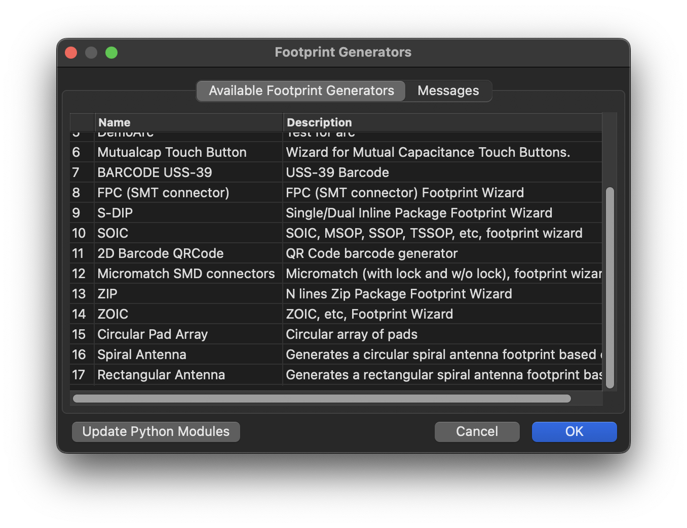
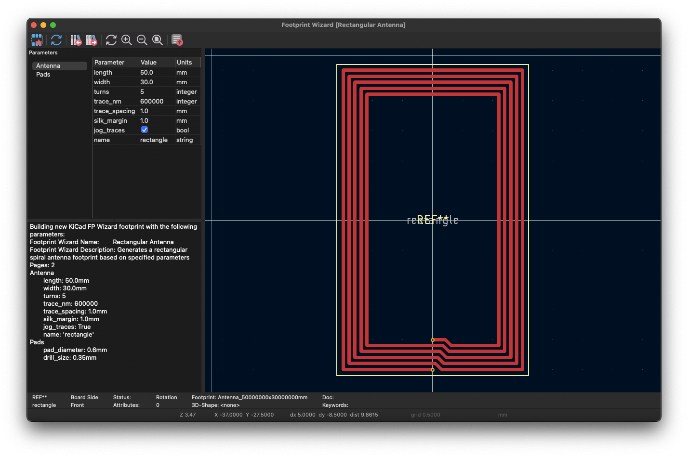

# KiCad Antenna Generators
Inspired by the need for NFC antennas. See also:

- [Javascript KiCad Antenna Generator](https://neurotech-hub.github.io/KiCad-Antenna-Generator/)
- [nideri/nfc_antenna_generator: generate nfc antenna module for kicad](https://github.com/nideri/nfc_antenna_generator)
- [ST NFC Inductance Calculator](https://eds.st.com/antenna/#/)
- [AN2972: How to design an antenna for dynamic NFC tags](https://neurotech-hub.github.io/KiCad-Antenna-Generator/an2972-how-to-design-an-antenna-for-dynamic-nfc-tags-stmicroelectronics.pdf)
- [Cheatsheet for writing KiCad v6 plugin scripts in Python](https://climbers.net/sbc/kicad-plugin-script-cheatsheet/)
- [KiCad/kicad-footprint-wizards](https://github.com/KiCad/kicad-footprint-wizards)

## Installation
Place the `*.py` file in the KiCad scripting folder. You can find a list of these by clicking into the Footprint Editor > Footprint Wizard > Messages tab. On MacOS: `/Users/.../Documents/KiCad/8.0/scripting/plugins/`.

You should see the new footprint wizards now.

> Note: I could not get around an overflow error when trying to cast uMM to int for the SetWidth() function. Therefore, trace widths are integers set in the pcbnew base unit of nanometers.

## Rectangle Tool
Antenna and Pads parameters are accessible on the left panel. There are two styles:

- Non-jogging
- Jogging

**0: Non-jogging**

**1: Jogging**

## Spiral Tool
Antenna and Pads parameters are accessible on the left panel.

**Standard Spiral**

**3 Segments per Turn**

**4 Segments per Turn**

## Tying Nets
You *will* get DRC errors if you don't tie nets. I was able to solve this in the Javascript generator by pasting the line `(net_tie_pad_groups "1,2")`. It is not yet clear how to do this in the Wizard, but the solution is easy. Use the shortcut `e` on the resulting footprint to get Preferences. In Clearance Overrides and Settings add pads `1,2` to Net Ties.

