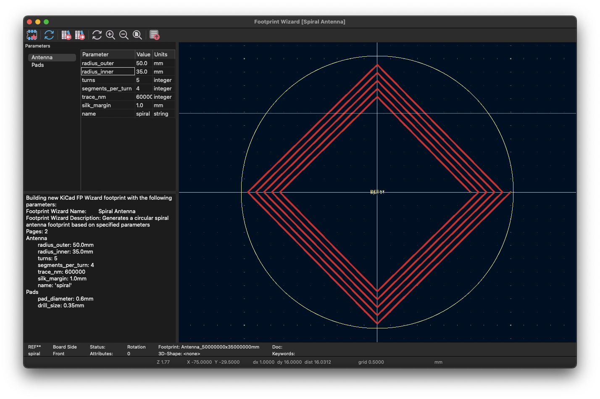

# KiCad Antenna Generators
Inspired by the need for NFC antennas. See also:

- [Javascript KiCad Antenna Generator](https://neurotech-hub.github.io/KiCad-Antenna-Generator/)
- [nideri/nfc_antenna_generator: generate nfc antenna module for kicad](https://github.com/nideri/nfc_antenna_generator)
- [ST NFC Inductance Calculator](https://eds.st.com/antenna/#/)
- [AN2972: How to design an antenna for dynamic NFC tags](https://neurotech-hub.github.io/KiCad-Antenna-Generator/an2972-how-to-design-an-antenna-for-dynamic-nfc-tags-stmicroelectronics.pdf)

## Installation
Place the `*.py` file in the KiCad scripting folder. You can find a list of these by clicking into the Footprint Editor > Footprint Wizard > Messages tab. On MacOS: `/Users/.../Documents/KiCad/8.0/scripting/plugins/`.

You should see the new footprint wizards now.

> Note: I could not get around an overflow error when trying to cast uMM to int for the SetWidth() function. Therefore, trace widths are integers set in the pcbnew base unit of nanometers.

## Rectangle Tool
Antenna and Pads parameters are accessible on the left panel. There are two styles:

- 0: Non-jogging
- 1: Jogging

**0: Non-jogging**

**1: Jogging**

## Spiral Tool
Antenna and Pads parameters are accessible on the left panel.

**Standard Spiral**

**3 Segments per Turn**

**4 Segments per Turn**
